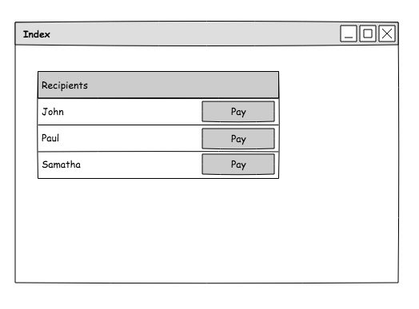
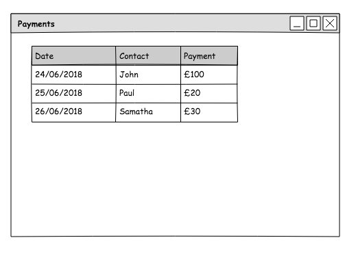

# CurrencyCloud Coolpay API tech test

###### A tech test for my application at Currencycloud

### Build status

[](https://codeclimate.com/github/Raefey/currencycloud_tech_test/maintainability)
[](https://codeclimate.com/github/Raefey/currencycloud_tech_test/test_coverage)

### Tech stack used
Text editor - [Atom](https://atom.io/)

Testing framework - [Rspec](http://rspec.info/)

Continuous integration service - [Travis CI](https://travis-ci.org/)

Code quality - [Code Climate](https://codeclimate.com/)

Web Framework - [Sinatra](http://sinatrarb.com/)

Coolpay API - [Coolpay](https://coolpayapi.docs.apiary.io/)
### User stories

```
As a User
I want to be able to Authenticate to Coolpay API
So other people cannot send my money

As a User
I want to be able to Add recipients
So I can list my friends easily

As a User
I want to be able to Send Money
So I can save time by not using my bank

As a User
I want to be send a confirmation message when a payment is successful
So that I'm not worrying about losing money
```

### Challenges
I'll outline the two most notable challenges.

1. I didn't want to post my login details for the API to Github, so no problem; I just saved them as environmental variables in my env.yml and added it to a `.gitignore` file. Problem solved. However when I came to use Travis for continuous integration, it failed every Rspec test as it was not able to log into the API. I found a handy tool in Travis; which allows  you to encrypt a file. Then before Travis runs it's script you tell it to decrypt the file with a unique key, meaning it gains access to the environmental variables. It even saves the decrypted file under a name of your choosing. Meaning there are no problems with access to the env.yml file.

2. When posting the payments, I would use the response from the API and access the values from each payment hash, using the relevant keys. I would iterate through the array of payments, posting information I thought would be useful to display, such as: Amount, Currency and Status. However I thought knowing who you had paid would be useful, this information was not in the API response. The recipient ID was in the response, however it is unreasonable for you to assume your users will know all their friends unique user IDs. So the solution is simple; search for user by ID and then print the name paired to it, except there is no API request to search by user ID. So I made my own method in the *RecipientList* class to search for a user by ID, which would return the name of that user. I used this method in my *PaymentList class*, by extracting the user ID of a payment, searching the recipient list for that ID and then adding a new key value pair to that payment with the name of the user; allowing me to print the name next to the payment. The classes became slightly too involved with each other for my liking, however it was a feature I strongly believed should be added, and was unable to do it using just the API response.

### Installation

I decided not to deploy my Web App, as I had gone to great lengths to hide my API keys, it seemed pointless to then go and deploy the app using my keys. However if you have your own key for the Coolpay API you can use my app here.

- Clone the Repo
- Run Bundle install
- Add an env.yml file with the following:
```
API_USERNAME: 'YOUR_USERNAME_HERE'
API_KEY: 'YOUR_API_KEY_HERE'
```
- Go to the project directory and run `rackup -p 4567`
- Go to `local:host4567`

To run tests do the above, then in the `currencycloud_tech_test` directory run RSpec

### Final thoughts

If I think of the API as it were a product there a few things I would change; I would first of all increase the information in the Response to avoid problems like the one I encountered with the user ID. I would also create a deleting function for deleting Recipients. Finally when making calls to the mock server in my tests, I would get the exact same response, no matter the Values or Headers, this allowed me to test that the API request was successful however I couldn't test if the variables I entered were being saved correctly, as the response was always the same. I enjoyed the project, as every part of the program was constantly making calls to the API which produced a few interesting challenges.

### If I had more time

I would make the overall aesthetic a bit nicer and flow between the pages more intuitive. I would've added the ability to just pay a recipient from the recipient page with a pay button. It would've been nice to have a delete function, but I don't believe it was possible with the API.
I would've tried to find a way to feature test the creation of payments and recipients without actually creating them as this made some features impossible to test without creating real recipients.

### Views
 These were diagrams I used during the process of creating the app, the App didn't finish looking quite like these, but they helped me to visualise what I was making.




